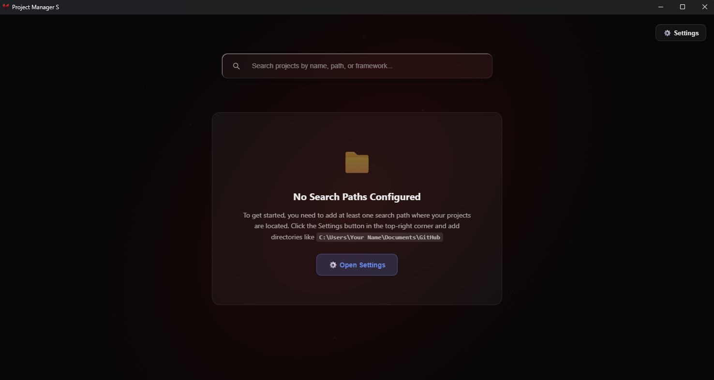

# PMS - Project Management System

A modern, beautiful project management application built with Electron, React, and TypeScript.


## ✨ Features

- 🔍 **Smart Project Detection** - Automatically scans and discovers projects from configured paths
- 🎨 **Beautiful Glass-Morphism UI** - Modern Figma-inspired design with smooth animations
- 🚀 **Multi-Editor Support** - Launch projects in VS Code, Cursor, or other editors
- 📊 **Project Insights** - View frameworks, dependencies, and last modified dates
- 🔎 **Powerful Search** - Instantly find projects by name, path, or framework
- 📄 **Pagination** - Clean navigation through large project collections
- 💾 **System Tray Integration** - Quick access to recent projects from the tray
- ⚙️ **Customizable Settings** - Configure search paths and default editors
- 🚀 **Launch at Startup** - Optional auto-start on Windows login

## 📦 Installation

1. Download `PMS-Setup.exe` from [Releases](https://github.com/SantosMaxime/pms/releases)
2. Run the installer
3. Launch PMS from your Start Menu or desktop shortcut

## 🖥️ Screenshots



## 🛠️ Development

### Prerequisites
- Node.js 18+ 
- npm or pnpm

### Recommended IDE Setup

- [VSCode](https://code.visualstudio.com/) + [ESLint](https://marketplace.visualstudio.com/items?itemName=dbaeumer.vscode-eslint) + [Prettier](https://marketplace.visualstudio.com/items?itemName=esbenp.prettier-vscode)

### Project Setup

```bash
# Install dependencies
$ npm install

# Run in development mode
$ npm run dev

# Build for Windows
$ npm run build:win

# For macOS
$ npm run build:mac

# For Linux
$ npm run build:linux
```

### Project Structure
```
pms/
├── src/
│   ├── main/          # Electron main process
│   ├── preload/       # Preload scripts
│   └── renderer/      # React frontend
├── build/             # Build resources (icons, installer scripts)
└── resources/         # App resources
```

## 📝 License

MIT License - Copyright (c) 2025 Santos Maxime

See [LICENSE](LICENSE) file for details.

## 👤 Author

**Santos Maxime**

- GitHub: [@SantosMaxime](https://github.com/SantosMaxime)

## 🤝 Contributing

Contributions, issues, and feature requests are welcome!

## ⭐ Show Your Support

Give a ⭐️ if this project helped you!

---

Built with ❤️ using Electron + React + TypeScript
